# Task 1: Repository Initialization

First, we are initializing the git repository with “ **git init** ” command.

We have initialized the master branch with a README.md file, created a main branch from
master and pushed it to origin.

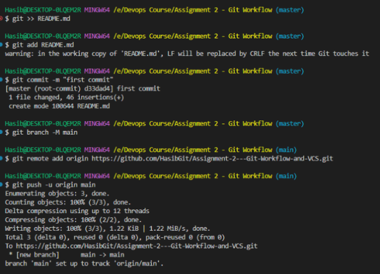

We’ve created two branches from master.

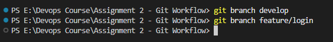

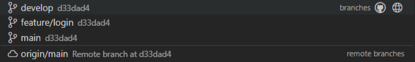

# Task 2: Branching Workflow

Created 3 more branches for feature and bugfix.

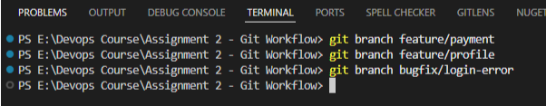

**Merge using “Merge” strategy**

Made some commits to the feature/payment branch. Merged feature/payment branch with main
branch.

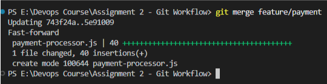

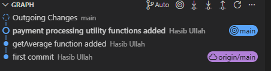

As there was no merge conflict, it was a “Fast-forward” merge.

**Merge using “Rebase” strategy**

We have committed some changes in “feature/profile” branch.

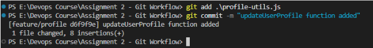

Then, we have rebased the feature/profile branch with the main branch.

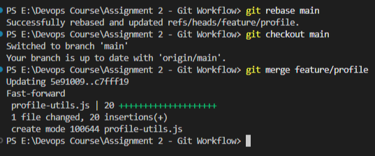

As a result, the feature/profile branch had all main branch changes.

Then, we merged the main branch with the feature/profile branch. It resulted in a fast-forward merge.

# Task 3: Commit History Management

We have 7 commits in the **develop** branch. We want to re-write the commit history to make it
more clean and organized before we merge the commits with main.

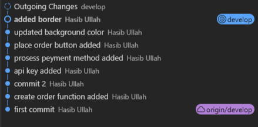

**Objectives:**

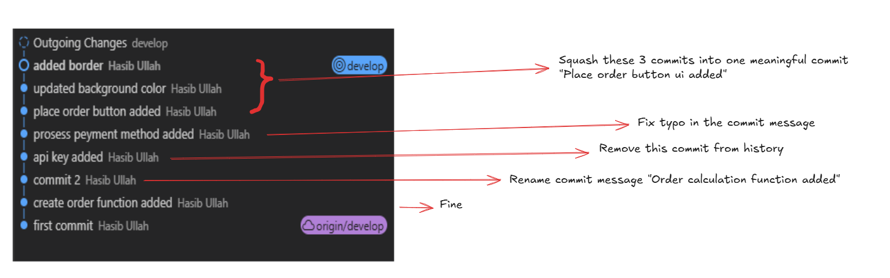

We start rebasing the last 7 commit messages in interactive mode.

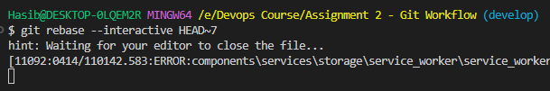

The first commit is directly picked without changes.

We update the commit message for the second commit.

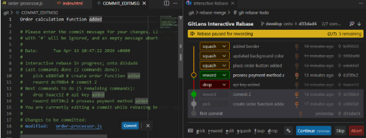

The third commit gets dropped.

We fix typo for the fourth commit.

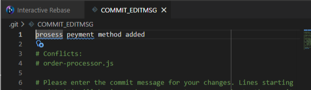

For the last 3 commits, we squash them into one commit with a meaningful commit message.

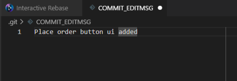

As a result, in the develop branch, we are left with only 3 commits as a result of re-writing the commit history.

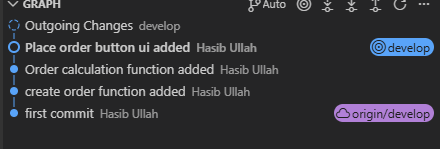

### Merge VS Rebase

| Feature             | Merge                                    | Rebase                                    |
| ------------------- | ---------------------------------------- | ----------------------------------------- |
| Basic idea          | Combines two branches with a new commit  | Moves your branch on top of another       |
| History             | Keeps history as-is (with merge commits) | Rewrites history (linear)                 |
| Commit graph        | Looks like a tree (branches preserved)   | Looks like a straight line                |
| New commit created? | Yes (merge commit)                       | No extra commit (commits are reapplied)   |
| Use case            | Safe for shared branches                 | Cleaner history for feature branches      |
| Conflicts           | Resolve once during merge                | May need to resolve multiple times        |
| Risk                | Safe (doesn’t rewrite history)           | Risky if already pushed (history changes) |
| Command             | `git merge branch-name`                  | `git rebase branch-name`                  |

### Squash & Reword

Both of these terms are related to git rebase.

Using **squash** operation, we can combine (squash) multiple commits into one single commit with a custom commit message.

Use case: Combine multiple redundant/ unnecessary commits into one meaningful commit.

Using **reword** operation, we can update the commit message of some particular commit.

Use case: Fix typo of a commit message or update some commit message to make it more meaningful.
